<div align="center">
  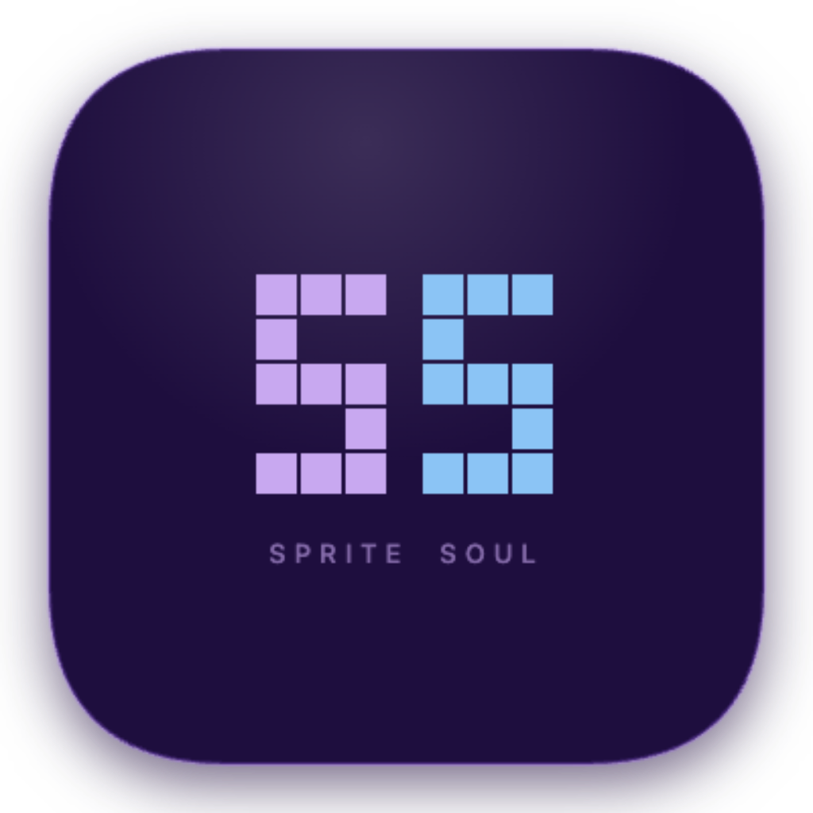

  <h1>SpriteSoul</h1>

  <p>A tiny pixel companion that lives on your desktop —<br>watches what you do, remembers your conversations, and talks like a friend.</p>

  
  
  
  
</div>

---

## Your companion, your character

<div align="center">
  <sub>Any image becomes a pixel companion — anime, photo, illustration, anything.</sub>
  <br/><br/>

  <table border="0" cellspacing="16" cellpadding="0">
    <tr>
      <td align="center">
        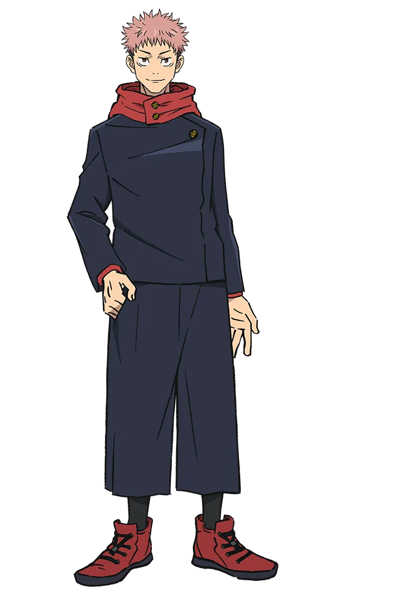<br/>
        ↓<br/>
        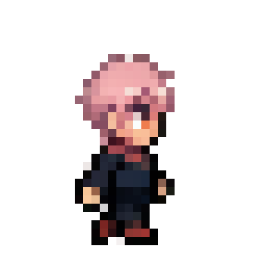<br/>
        <sub>Itadori</sub>
      </td>
      <td align="center">
        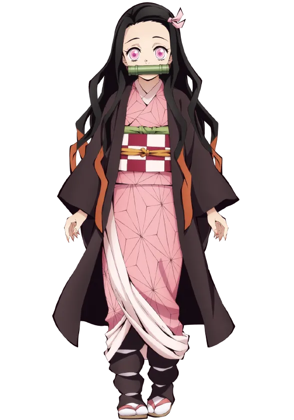<br/>
        ↓<br/>
        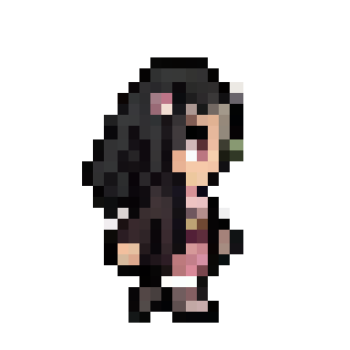<br/>
        <sub>Nezuko</sub>
      </td>
      <td align="center">
        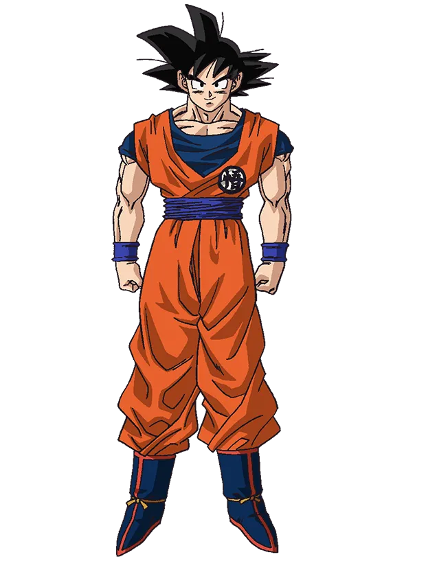<br/>
        ↓<br/>
        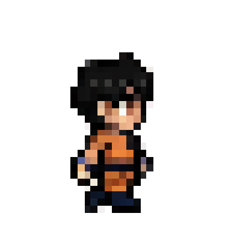<br/>
        <sub>Goku</sub>
      </td>
      <td align="center">
        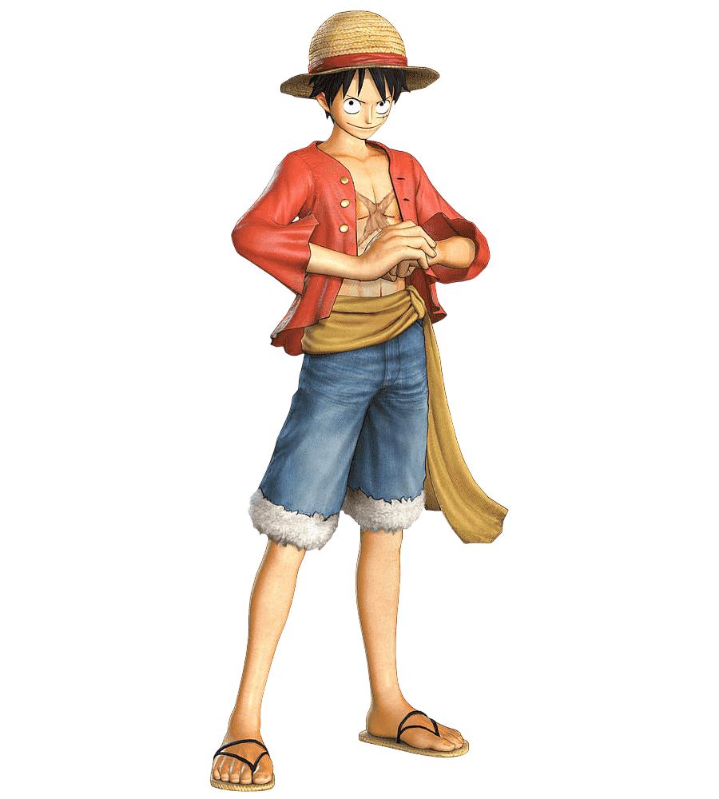<br/>
        ↓<br/>
        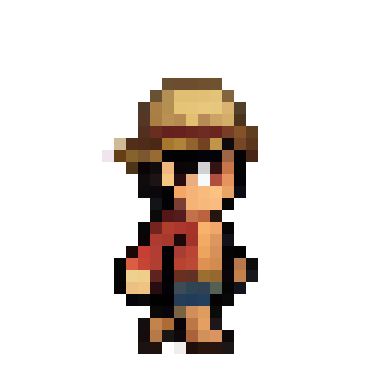<br/>
        <sub>Luffy</sub>
      </td>
      <td align="center">
        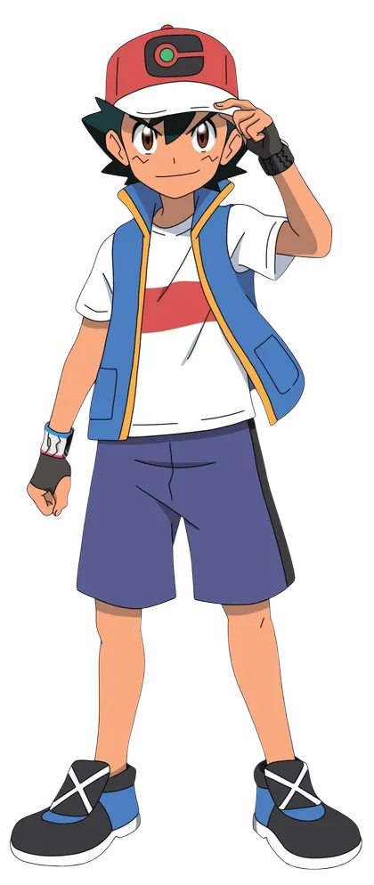<br/>
        ↓<br/>
        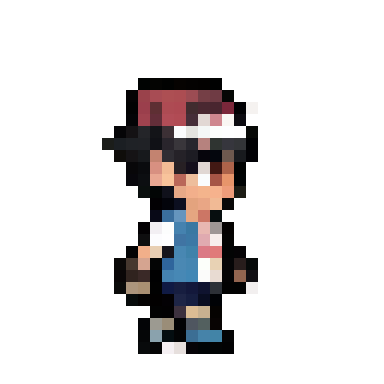<br/>
        <sub>Ash</sub>
      </td>
    </tr>
  </table>
</div>

---

## Demo

<table border="0" cellspacing="8" cellpadding="0">
  <tr>
    <td align="center">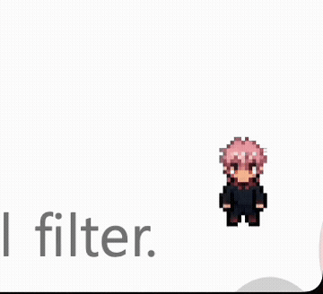<br/><sub>💬 Chat</sub></td>
    <td align="center">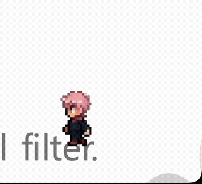<br/><sub>🗣️ Proactive</sub></td>
  </tr>
  <tr>
    <td align="center">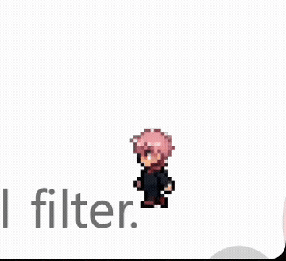<br/><sub>😴 Getting Tired</sub></td>
    <td align="center">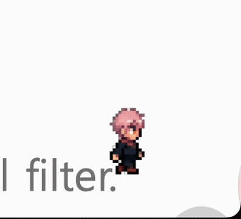<br/><sub>💤 Falling Asleep</sub></td>
  </tr>
</table>

---

## What is SpriteSoul?

SpriteSoul is a desktop companion app for macOS. It generates a unique pixel art character from your reference image, places it on your screen as a transparent overlay, and lets it talk with you through a local LLM.

The companion:
- **walks around** your desktop, idles, falls asleep, and reacts
- **watches your screen** every 60 seconds and makes casual remarks
- **remembers conversations** across sessions
- **has a personality** defined by a persona you create at setup

Everything runs locally. No cloud, no subscriptions, no data sent anywhere.

---

## Features

### Sprite Generation
- Upload any reference image (photo, illustration, character art)
- Optionally describe the character's appearance in English (e.g. `girl with pink hair and cat ears`)
- FLUX.2-klein-base-4B + PixelArt LoRA generates a 4×4 spritesheet with idle, walk, sleep, and react animations
- K-centroid downscaling produces clean pixel art edges

### Companion Behavior
- **FSM-based** — idle, walk, and sleep states with natural timing
- **Emotion system** — internal energy/boredom values decay over time
  - Low energy → falls asleep automatically
  - High boredom → starts walking or initiates conversation
  - Click to wake up and boost energy
- **Emotion floating icons** — floating `z` (purple) when tired, `...` (yellow) when bored; appear above the companion's head and drift upward
- **Micro-interactions** — random yawning stretch, "banzai" pose, breathing animation, edge leaning
- **Mouse-reactive** — companion locks to IDLE while you chat
- **Entrance animation** — pops in with a banzai pose and flash effect on every launch
- **Click-through overlay** — transparent areas pass mouse events to windows below; only the sprite and speech bubble are interactive

### Conversation
- Powered by Ollama (`gemma4:12b-it-q4_K_M`) running locally
- **Streaming responses** — tokens appear in real time as the model generates them
- Pixel speech bubble renders progressively; a `...` thinking bubble appears while connecting
- Click the companion to open the input box
- Short, casual replies — the companion is a friend, not an assistant
- **Proactive messaging** — initiates conversation when bored (boredom > 70%, 5-minute cooldown), and comments on screen context changes (35% chance)

### Screen Awareness
- Captures your screen every 60 seconds via a bundled `sc_helper` binary using **ScreenCaptureKit**
- Resizes to 1280px and sends to the vision model
- Extracts: what you're doing (context) + a casual remark
- Context is injected into the next chat prompt so the companion knows what you're up to
- First launch prompts for Screen Recording permission once — persists across sessions

### Memory & Persona
- Last 10 conversation turns persisted to `user://memory.json`
- User's name extracted from natural phrases ("내 이름은 X야", "나는 X야")
- Persona saved to `user://persona.json` — name, appearance, system prompt
- Right-click → "새 캐릭터 만들기" to reset and create a new character
- **Affinity system** — conversation count tracked in `user://affinity.json`; tone shifts across 4 levels (first meeting → acquaintance → close friend → old friend) injected into each prompt
- **Daily diary** — on each new day, yesterday's conversation is summarized by the LLM into one sentence and stored in `user://diary.json`; the last 3 days are injected into the system prompt so the companion remembers past sessions

---

## System Requirements

| Component | Requirement |
|-----------|-------------|
| OS | macOS (Apple Silicon recommended) |
| RAM | 16GB+ unified memory (for FLUX.2 sprite generation) |
| Disk | 20GB+ free (13GB model + generated sprites) |
| Godot | 4.6 |
| Python | 3.10+ |
| Ollama | Latest |

> **Apple Silicon (M1/M2/M3/M4)** is the recommended platform. Intel Macs will work but sprite generation may be significantly slower.

---

## Prerequisites

### 1. Godot 4.6

Download from [godotengine.org](https://godotengine.org/download).

### 2. Ollama + Model

```bash
# Install Ollama (official installer required — Homebrew version is missing required binaries)
curl -fsSL https://ollama.com/install.sh | sh

# Pull the vision-language model (7.6GB)
ollama pull gemma4:12b-it-q4_K_M

# Start the server (keep this running in the background)
ollama serve
```

### 3. Python Environment

```bash
cd sprite_gen
python3 -m venv .venv
source .venv/bin/activate
pip install -r requirements.txt
```

> The venv is used automatically by SpriteGenerator.gd — you don't need to activate it manually after this.

### 4. HuggingFace Token

Sprite generation uses `black-forest-labs/FLUX.2-klein-base-4B`. A free HuggingFace account and token is required to download it (~13GB on first run).

1. Go to [huggingface.co/settings/tokens](https://huggingface.co/settings/tokens)
2. Create a token with **Read** permission
3. Enter it in the setup screen when prompted — saved locally to `user://hf_token.txt`

---

## Installation

```bash
git clone https://github.com/Jadest03/sprite-soul.git
cd sprite-soul

# Set up Python environment
cd sprite_gen
python3 -m venv .venv
source .venv/bin/activate
pip install -r requirements.txt
cd ..

# Open in Godot editor
open -a Godot project.godot
```

Then press **▶ Run** (F5) in the Godot editor.

---

## First Run

The first time you launch, a setup screen appears:

1. **Character name** — give your companion a name (used in conversation and persona)
2. **Appearance description** *(optional)* — describe the character in English to guide generation
   - Example: `young male with pink spiky hair, dark navy uniform, red shoes`
   - More specific → more consistent result
3. **Reference image** — upload any image to visually condition the sprite generation
   - Works best with clear full-body character art or photos
   - Used alongside the appearance description for stronger conditioning
4. **HuggingFace token** — paste your token (required for the ~13GB first download)
5. **Your name** *(optional)* — the companion will use it when talking to you
6. Click **완성** — sprite generation begins

Generation takes **5–15 minutes** on Apple Silicon (M1/M2/M3/M4) depending on model cache state.

After generation, a preview screen shows idle/walk/sleep animations. Click **이대로 시작** to launch the companion.

---

## Usage

### Talking to the Companion
- **Left-click** the companion to open the input box
- Type your message and press Enter
- The companion responds in a speech bubble with a typewriter effect
- A `...` thinking bubble appears while waiting for a response
- The bubble auto-hides after 5 seconds

### Interacting
| Action | Result |
|--------|--------|
| Left-click | Open chat input (companion bounces) |
| Left-click (while input open) | Close input |
| Right-click | Context menu (reset / quit) |
| Click while sleeping | Wake up |
| ESC | Close chat input |

### Reset / New Character
Right-click → **새 캐릭터 만들기** — clears the persona, sprites, memory, and returns to setup.

---

## Permissions (macOS)

Screen awareness requires **Screen Recording** permission.

**System Settings → Privacy & Security → Screen Recording → enable Godot (or SpriteSoul)**

Restart after granting. Without it, the companion can still chat but won't react to what's on your screen.

> If you're running the exported `.app`, the permission dialog will appear automatically with an explanation on first launch.

---

## How It Works

```
┌──────────────────────────────────────────────────────┐
│  Godot (transparent overlay, always on top)           │
│                                                       │
│  ┌──────────┐    tick     ┌───────────────────────┐  │
│  │   FSM    │◄───────────►│   BehaviorSelector    │  │
│  │ idle     │             │ (utility-based)        │  │
│  │ walk     │             └───────────────────────┘  │
│  │ sleep    │                         ▲               │
│  └──────────┘             ┌───────────┴───────────┐  │
│       │                   │    EmotionState        │  │
│       │ state anim        │ energy / boredom       │  │
│       ▼                   └───────────────────────┘  │
│  AnimatedSprite2D                                     │
│                                                       │
│  ┌──────────────────────────────────────────────┐    │
│  │  ChatUI                                       │    │
│  │   ├── user input ──────► Ollama /api/chat     │    │
│  │   ├── screen capture (60s) ──► Ollama (VL)   │    │
│  │   │        └── CONTEXT injected into prompt  │    │
│  │   └── proactive comment (35% chance)         │    │
│  └──────────────────────────────────────────────┘    │
│                                                       │
│  MemoryStore  ── last 10 turns (user://memory.json)  │
│  UserProfile  ── your name (user://user_profile.json)│
│  PersonaGenerator ── persona (user://persona.json)   │
└──────────────────────────────────────────────────────┘

Sprite Generation (one-time at setup):
  reference image + appearance text
       │
       ▼
  FLUX.2-klein-base-4B + PixelArt LoRA
       │
       ▼
  4×4 spritesheet → frame split → k-centroid downscale
       │
       ▼
  user://sprites/*.png
```

### Sprite Generation Pipeline
1. `SpriteGenerator.gd` spawns a thread and runs `sprite_gen/generate_sprites.py`
2. Python loads FLUX.2-klein-base-4B via diffusers + PixelArt LoRA (`svntax-dev/pixel_spritesheet_4walk_small_lora_v1`)
3. Reference image is VAE-encoded and concatenated as visual conditioning tokens
4. Appearance text + layout prompt fed into Qwen3 text encoder
5. 512×512 spritesheet generated in 15 inference steps
6. K-centroid downscale (÷4 then ×4 with nearest) produces pixel art edges
7. Frame splitter extracts 12 animation frames with row-consistent bounding boxes

### Conversation Pipeline
1. User input → `MemoryStore.build_messages()` → full message history with system prompt
2. Screen context (if available) appended to system prompt
3. POST to `http://localhost:11434/api/chat` with `gemma4:12b-it-q4_K_M`
4. Response streamed back, typed out character by character in the speech bubble

---

## Project Structure

```
sprite-soul/
├── autoloads/
│   └── EventBus.gd          # Global signal bus
├── scenes/
│   ├── Main.tscn             # Root scene
│   ├── Companion.tscn        # Sprite + FSM
│   ├── ChatUI.tscn           # Bubble + input
│   └── PersonaSetup.tscn     # First-run setup UI
├── scripts/
│   ├── Main.gd               # App lifecycle, window management
│   ├── Companion.gd          # Behavior loop, micro-interactions
│   ├── CompanionFSM.gd       # State machine (idle/walk/sleep)
│   ├── BehaviorSelector.gd   # Utility-based state transitions
│   ├── EmotionState.gd       # Energy/boredom simulation
│   ├── ChatUI.gd             # Ollama integration, screen awareness
│   ├── PixelSpeechBubble.gd  # Pixel-art speech bubble renderer
│   ├── PixelInputBox.gd      # Chat input UI
│   ├── PersonaSetup.gd       # Setup screen UI
│   ├── PersonaGenerator.gd   # Persona save/load
│   ├── SpriteGenerator.gd    # Spawns Python generation thread
│   ├── MemoryStore.gd        # Conversation history
│   └── UserProfile.gd        # User name persistence
├── sprite_gen/
│   ├── generate_sprites.py   # FLUX.2 generation + frame splitting
│   └── requirements.txt      # Python dependencies
├── assets/
│   └── fonts/
│       └── PixelifySans-Regular.ttf
├── docs/
│   ├── reference_example.webp  # Reference image example
│   ├── preview_transparent.webp # Generated companion animation
│   └── demo_*.gif              # Feature demo GIFs
└── scripts/
    └── export_macos.sh       # Build automation script
```

---

## Building / Exporting

To build the macOS `.app`:

```bash
./scripts/export_macos.sh
```

This runs a headless Godot export and patches `NSScreenCaptureUsageDescription` into `Info.plist` automatically.

The output is at `build/SpriteSoul.app`.

---

## Troubleshooting

**"(연결 안 됨)" appears when chatting**
→ Ollama is not running. Run `ollama serve` and restart the app.

**Sprite generation fails immediately**
→ Check that your HuggingFace token is valid and has Read permissions. First run downloads ~13GB — make sure you have enough disk space and a stable connection.

**Generation progress stuck at 0%**
→ The model is downloading in the background. Check disk usage growth at `~/.cache/huggingface/hub/`. The progress bar updates every 3 seconds.

**Companion only sees the desktop wallpaper**
→ Screen Recording permission is not granted. See [Permissions](#permissions-macos) above.

**Sprite generation is very slow**
→ Normal on first run (model load + generation). Apple Silicon M1/M2/M3 with 16GB takes ~10 min. Subsequent runs are faster (model already cached).

**App doesn't start after reset**
→ Make sure `ollama serve` is running before launching.

**Generated sprite doesn't match the reference image**
→ Try adding a more specific appearance description. The reference image conditions shape/color broadly — the text description helps with specific features (hair color, clothing style).

---

## Acknowledgments

- [FLUX.2-klein-base-4B](https://huggingface.co/black-forest-labs/FLUX.2-klein-base-4B) by Black Forest Labs
- [pixel_spritesheet_4walk_small_lora_v1](https://huggingface.co/svntax-dev/pixel_spritesheet_4walk_small_lora_v1) by svntax-dev
- [Ollama](https://ollama.com) for local LLM serving
- [Pixelify Sans](https://fonts.google.com/specimen/Pixelify+Sans) font
- Built with [Godot 4.6](https://godotengine.org)

---

## License

MIT
