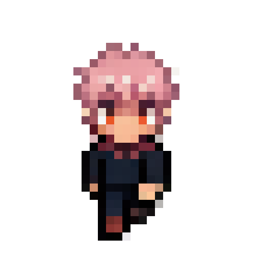

<div align="center">
  

  <h1>SpriteSoul</h1>

  <p>A tiny pixel companion that lives on your desktop —<br>watches what you do, remembers your conversations, and talks like a friend.</p>

  

  <br/>
  <sub>Generated from a reference image using FLUX.2 + PixelArt LoRA — running fully local</sub>
</div>

---

## Features

- **Custom sprite generation** — upload a reference image + appearance description and generate a unique pixel character using FLUX.2-klein + PixelArt LoRA
- **Local LLM conversation** — chat via Ollama (qwen3-vl), no data leaves your machine
- **Screen awareness** — the companion watches your screen every 60 seconds and reacts to what you're doing
- **Memory** — remembers past conversations across sessions
- **Behavior FSM** — idle, walk, sleep, and react states with natural timing
- **Persona system** — each character has a name, personality, and speech style

---

## System Requirements

| Component | Requirement |
|-----------|-------------|
| OS | macOS (Apple Silicon recommended) |
| RAM | 16GB+ unified memory recommended (for FLUX.2 sprite generation) |
| Godot | 4.6 |
| Python | 3.10+ |
| Ollama | Latest |

> **Note:** Sprite generation requires FLUX.2-klein-base-4B (~13GB download on first run). If your machine has less than 16GB unified memory, generation may be slow or fail.

---

## Prerequisites

### 1. Godot 4.6

Download from [godotengine.org](https://godotengine.org/download).

### 2. Ollama + Model

```bash
# Install Ollama
brew install ollama

# Pull the vision model (6.1GB)
ollama pull qwen3-vl:8b-instruct

# Start the server
ollama serve
```

### 3. Python Environment

```bash
cd sprite_gen
python -m venv .venv
source .venv/bin/activate
pip install -r requirements.txt
```

### 4. HuggingFace Token

Sprite generation uses `black-forest-labs/FLUX.2-klein-base-4B`. You'll need a HuggingFace token to download it on first run.

1. Go to [huggingface.co/settings/tokens](https://huggingface.co/settings/tokens)
2. Create a token with **Read** permission
3. Enter it in the setup screen when prompted (saved locally to `user://hf_token.txt`)

---

## Installation

```bash
git clone https://github.com/mingyu/sprite-soul.git
cd sprite-soul

# Set up Python environment
cd sprite_gen
python -m venv .venv
source .venv/bin/activate
pip install -r requirements.txt
cd ..

# Open project in Godot
open -a Godot project.godot
```

Then press **Run** in the Godot editor.

---

## First Run

1. **Character name** — give your companion a name
2. **Appearance description** *(optional)* — describe the character in English (e.g. `girl with pink hair and cat ears`) to guide sprite generation
3. **Reference image** — upload any image (photo, illustration) to visually condition the sprite generation
4. **HuggingFace token** — required for the first sprite generation (~13GB model download)
5. **Your name** *(optional)* — the companion will use it in conversation
6. Click **완성** and wait for sprite generation to complete (~5–15 min depending on hardware)
7. Preview the animations, then click **이대로 시작** to launch the companion

---

## Permissions (macOS)

Screen awareness requires **Screen Recording** permission for Godot.

**System Settings → Privacy & Security → Screen Recording → add Godot and enable it**

Restart Godot after granting permission. Without it, the companion can still chat but won't be able to see your screen.

---

## How It Works

```
┌─────────────────────────────────────────────┐
│  Godot (overlay window, always on top)       │
│                                              │
│  CompanionFSM ──── idle / walk / sleep       │
│       │                                      │
│  ChatUI                                      │
│    ├── user message ──► Ollama (chat)        │
│    ├── screen capture (60s) ──► Ollama (VL)  │
│    │        └── context injected into prompt │
│    └── proactive comment (35% chance)        │
│                                              │
│  MemoryStore ── persists last 10 messages    │
│  UserProfile ── remembers your name          │
└─────────────────────────────────────────────┘
```

- **Sprite generation** runs once at setup via `sprite_gen/generate_sprites.py` (FLUX.2 + LoRA)
- **Conversation** uses Ollama's local API at `http://localhost:11434`
- **Screen capture** uses `screencapture` + `sips` (macOS built-in tools)
- **Persona** is saved to `user://persona.json` and loaded at startup

---

## Troubleshooting

**"(연결 안 됨)" appears when chatting**
→ Ollama is not running. Run `ollama serve` and restart the app.

**Sprite generation fails immediately**
→ Check that your HuggingFace token is valid. First run downloads ~13GB — make sure you have enough disk space and a stable connection.

**Companion only sees the desktop wallpaper**
→ Screen Recording permission is not granted. See [Permissions](#permissions-macos) above.

**Sprite generation is very slow**
→ Normal on first run (model load + generation). Apple Silicon M1/M2/M3 with 16GB takes ~10 min. Subsequent runs are faster.

**App doesn't start after reset**
→ Make sure `ollama serve` is running before launching.

---

## License

MIT
